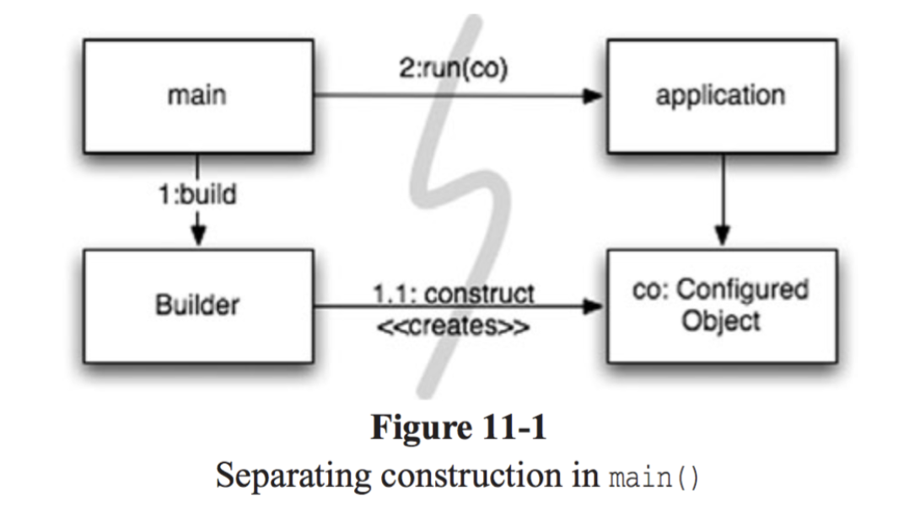
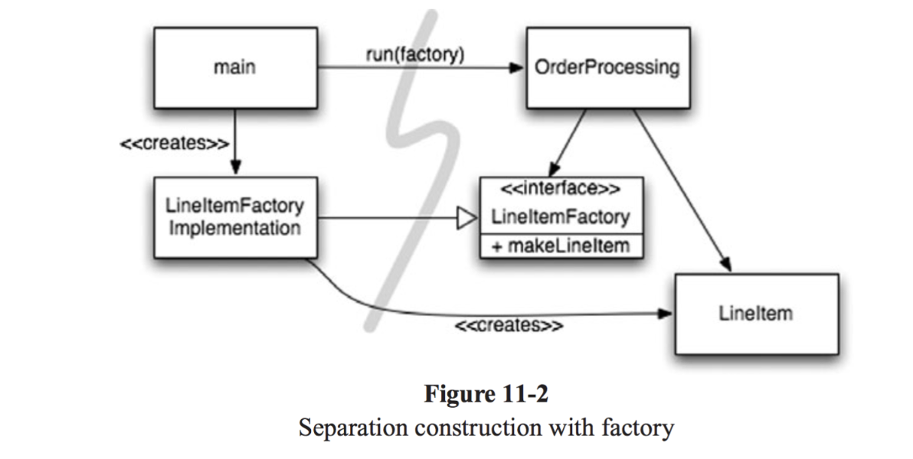

# 11. 시스템
> "복잡성은 죽음이다. 개발자에게서 생기를 앗아가며, 제품을 계획하고 제작하고 테스트하기 어렵게 만든다."  
~~~
서론: 도시를 세운다면? 
여러분이 도시를 세운다면? 온갖 세세한 사항을 혼자서 직접 관리할 수 있을까? 아마도 불가능하리라. 이미 세워진 도시라도 한 사람의 힘으로는 무리다.  
그럼에도 불고하고 도시는 잘 돌아간다. 왜? 각 분야를 관리하는 팀이 있기 때문이다. 도시에는 큰 그림을 그리는 사람들도 있으며 작은 사항에 집중하는 사람들도 있다.
도시가 돌아가는 또 다른 이유는 적절한 추상화와 모듈화 때문이다. 그래서 큰 그림을 이해하지 못할지라도 개인과 개인이 관리하는 '구성요소'는 효율적으로 돌아간다.
흔히 소프트웨어 팀도 도시처럼 구성한다. 그런데 막상 팀이 제작하는 시스템은 비슷한 수준으로 관심사를 분리하거나 추상화를 이뤄내지 못한다. 깨끗한 코드를 구현하면 낮은 추상화 수준에서 관심사를 분리하기 쉬워진다. 
이 장에서는 높은 추상화 수준, 즉 '시스템' 수준에서도 깨끗함을 유지하는 방법을 살펴본다. 
~~~

## 시스템 제작과 시스템 사용을 분리하라
우선 **제작**과 **사용**은 아주 다르다는 사실을 명심한다. 
> 소프트웨어 시스템은 (애플리케이션 객체를 제작하고 의존성을 서로 '연결'하는) `준비 과정`과 (준비 과정 이후에 이어지는) `런타임 로직`을 분리해야 한다.

시작 단계는 모든 애플리케이션이 풀어야 할 `관심사`다. 이것이 이 장에서 우리가 맨 처음 살펴볼 관심사다. `관심사 분리`는 우리 분야에서 가장 오래되고 가장 중요한 설계 기법 중 하나다.  
불행히도 대다수 애플리케이션은 시작 단계라는 관심사를 분리하지 않는다. 준비 과정 코드를 주먹구구식으로 구현할 뿐만 아니라 런타임 로직과 마구 뒤섞는다. 다음이 전형적인 예다.
~~~java
public Service getService() {
	if (service == null) {
		service = new MyServiceImpl(...); // 모든 상황에 적합한 기본값일까?
	}
	
	return service;
}
~~~
이것이 초기화 지연(Lazy Initialization) 혹은 계산 지연(Lazy Evaluation)이라는 기법이다. 장점은 여러 가지다. 
1. 실제로 필요할 때까지 객체를 생성하지 않으므로 불필요한 부하가 걸리지 않는다. 
	+ 따라서 애플리케이션을 시작하는 시간이 그만큼 빨라진다.
2. 어떤 경우에도 null 포인터를 반환하지 않는다.

하지만 이 코드로 인해 우리의 시스템은 MyServiceImpl 객체에 대한 의존성을 가지게 되었고 MyServiceImpl의 사용 여부와 관계 없이 무조건 이 의존성을 만족해야 하게 되었다.  
테스트도 문제다. MyServiceImpl이 무거운 객체라면 단위 테스트에서 getService() 메서드를 호출하기 전에 적절한 `테스트 전용 객체(TEST DOUBLE 이나 MOCK OBJECT)`를 service 필드에 할당해야 한다.  
또한 일반 런타임 로직에다 객체 생성 로직을 섞어놓은 탓에(service가 null인 경로와 null이 아닌 경로 등) 모든 실행 경로도 테스트해야 한다.   
책임이 둘이라는 말은 메서드가 작업을 두 가지 이상 수행한다는 의미다. `즉, 작게나마 단일 책임 원칙(SRP)를 깬다는 의미이다.`

이러한 생성/사용의 분산은 모듈성을 저해하고 코드의 중복을 가져오므로 **잘 정돈된 견고한 시스템을 만들기 위해서는 전역적이고 일관된 의존성 해결 방법을 통해 위와 같은 작은 편의 코드들이 모듈성의 저해를 가져오는 것을 막아야 한다.**  

### Main 분리
시스템과 생성과 시스템 사용을 분리하는 한 가지 방법으로, `생성`과 관련한 코드는 `모두 main이나 main이 호출하는 모듈로` 옮기고, 나머지 시스템은 모든 객체가 생성되었고 `모든 의존성이 연결되었다고 가정`한다.
###### 그림 11.1 main()에서 생성 분리

~~~
제어 흐름은 따라가기 쉽다. main 함수에서 시스템에 필요한 객체를 생성한 후 이를 애플리케이션에 넘긴다.
애플리케이션은 그저 객체를 사용할 뿐이다. main과 애플리케이션 사이에 표시된 의존성 화살표의 방향에 주목한다.  
모든 화살표가 main 쪽에서 애플리케이션 쪽을 향한다. 즉, 애플리케이션은 main이나 객체가 생성되는 과정을 전혀 모른다는 뜻이다.  
단지 모든 객체가 적절히 생성되었다고 가정한다.
~~~

### 팩토리
물론 떄로는 객체가 `생성되는 시점`을 애플리케이션이 결정할 필요도 생긴다.   
예를 들어, 주문처리 시스템에서 애플리케이션은 LineItem 인스턴스를 생성해 Order에 추가한다. 이때는 `추상팩토리 패턴(Abstract Factory pattern)`을 사용한다.  
그러면 LineItem을 생성하는 시점은 애플리케이션이 결정하지만 LineItem을 생성하는 코드는 애플리케이션이 모른다.
###### 그림 11.2 팩토리로 생성 분리

~~~
여기서도 마찬가지로 모든 의존성이 main에서 OrderProcessing 애플리케이션으로 향한다.
즉, OrderProcessing 애플리케이션은 LineItem이 생성되는 구체적인 방법을 모른다.
그 방법은 main 쪽에 있는 LineItemFactoryImplementation이 안다.  
그럼에도 OrderProcessing 애플리케이션은 LineItem 인스턴스가 생성되는 시점을 완벽하게 통제하며,
필요하다면 Orderprocesssing 애플리케이션에서만 사용하는 생성자 인수도 넘길 수 있다.
~~~

### 의존성 주입
`사용과 제작을 분리하는` 강력한 메커니즘 하나가 `의존성 주입(Dependency Injection, DI)`이다.  
의존성 주입은 제어 역전(Inversion of Control, IoC 기법)을 의존성 관리에 적용한 메커니즘이다.  
제어 역전에서는 한 객체가 맡은 보조 책임을 새로운 객체에게 전적으로 떠넘긴다. 새로운 객체는 넘겨받은 책임만 맡으므로 `단일 책임 원칙(Single Responsibility Prrinsicple, SRP)`을 지키게 된다.  
의존성 관리 맥락에서는 객체는 의존성 자체를 인스턴스로 만드는 책임은 지지 않는다. 대신에 이런 책임을 다른 '전담' 메커니즘에 넘겨야만 한다. 그렇게 함으로써 제어를 역전한다.  
초기 설정은 시스템 전체에서 필요하므로 대개 '책임질' 메커니즘으로 'main' 루틴이나 특수 `컨테이너`를 사용한다.
> 의존성 주입은 클래스가 의존성을 해결하려 시도하지 않는다. `클래스는 완전히 수동적이다.`  
> 대신에 의존성을 주입하는 방법으로 stter 메서드나 생성자 인수를(혹은 둘다) 제공한다.  
> DI 컨테이너는(대개 요청이 들어올 때마다) 필요한 객체의 인스턴스를 만든 후 생성자 인수나 설정 메서드를 사용해 의존성을 설정한다.
> - 실제로 생성되는 객체 유형은 설정 파일에서 지정하거나 특수 생성 모듈에서 코드로 명시한다.

## 확장
'처음부터 올바르게' 시스템을 만들 수 있다는 믿음은 미신이다. 대신에 우리는 오늘 주어진 사용자 스토리에 맞춰 시스템을 구현해야 한다. 내일은 새로운 스토리에 맞춰 시스템을 조정하고 확장하면 된다.  
`이것이 반복적이고 점진적인 애자일 방식의 핵심이다.`  
> 테스트 주도 개발(TDD), 리팩터링, (TDD와 리팩터링으로 얻어지는) 깨끗한 코드는 코드 수준에서 시스템을 조정하고 확장하기 쉽게 만든다.  

하지만 시스템 수준에서는 어떨까? 시스템 아키텍처는 사전 계획이 필요하지 않을까? 단순한 아키텍처를 복잡한 아키텍처로 조금씩 키울 수 없다는 현실은 정확하다. 맞는 말 아닌가?
> 소프트웨어 시스템은 물리적인 시스템과 다르다. 관심사(Concern)를 적절히 분리해 관리한다면 소프트웨어 아키텍처는 점진적으로 발전할 수 있다.  

### 횡단(cross-cutting) 관심사
> 이론적으로는 독립된 형태로 구분될 수 있지만 실제로는 코드에 산재하기 쉬운 부분들을 뜻한다.
> + 트랜잭션
> + 보안
> + 일부 영속적인 동작

반면 EJB2 아키텍처는 일부 영역에서 관심사(Concern)을 거의 완벽하게 분리한다.  
이는 AOP(aspect-oriented programming)을 통해 트랜잭션, 보안, 영속성과 같은 횡단 관심사(Cross-cutting concern)의 모듈성을 되살리고 있다.  
AOP에서는 "코드의 어느 부분에 어떤 추가적인 기능을 삽입할까"에 대한 정의를 aspect라는 형태로 제공한다.