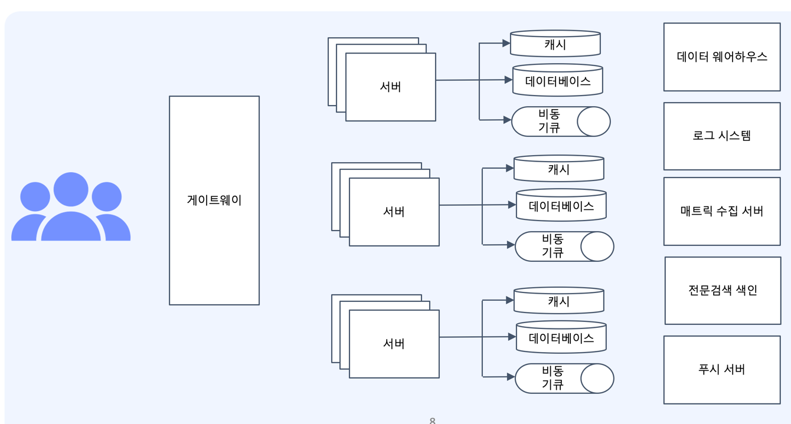

# 대용량 시스템에 대한 이해
---
## 웹의 기본 아키텍처
> 클라이어트 -> 웹서버 -> 웹 어플리케이션 서버 -> 데이터 베이스  

- 웹서버
    - 파일, css, html과 같이 `정적인 데이터들`을 담당
- 웹 어플리케이션 서버
    - 데이터베이스에 접근하여 `동적으로 변하는 데이터들을` 처리
    
두 가지를 나누게 된 이유는 웹의 복잡도가 증가했기 때문이다.

+ 대용량 시스템의 모습 훓어보기
